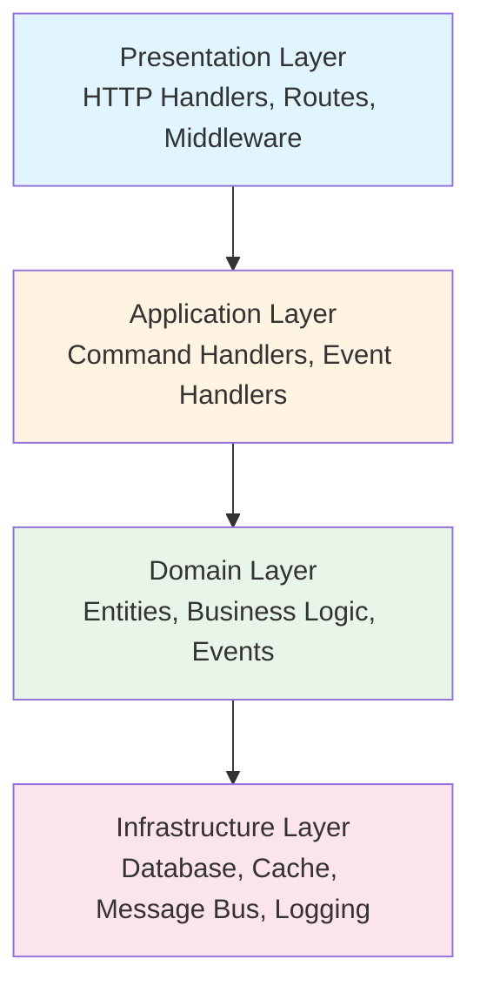
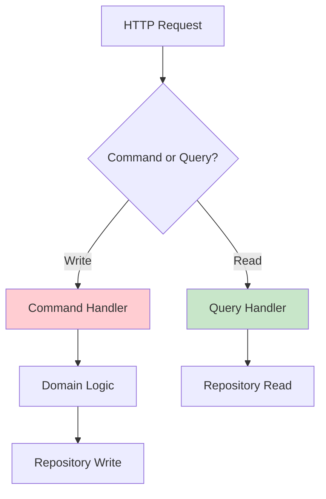
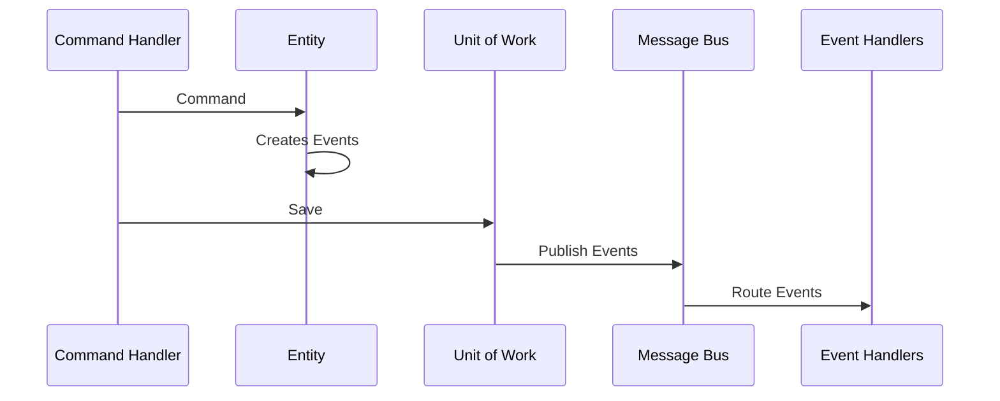
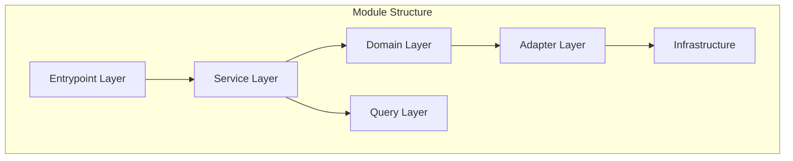

<div align="center">

# 🛍️ Shikposh

**Online Clothing Marketplace Platform**

[](https://go.dev/)
[](LICENSE)
[]()

A modern e-commerce platform for buying and selling clothing

[About](#-about) • [Features](#-features) • [Tech Stack](#-tech-stack) • [Architecture](#-architecture) • [Getting Started](#-getting-started)

</div>

---

## 📖 About

**Shikposh** is a comprehensive online marketplace platform that enables sellers and buyers to connect and conduct transactions for clothing and fashion items.

### 🎯 Project Goals

- **Sellers** can register products with full details (images, price, size, color, etc.)
- **Buyers** can easily search, view, and purchase products
- **Review & Rating System** helps users make informed decisions
- **Diverse Categories** for quick product access

---

## ✨ Features

### 👥 User Management

- User registration and authentication
- Custom avatar profiles
- Session management

### 🏪 Seller Management

- Seller registration
- Product management panel
- Image upload and management

### 👕 Product Management

- Complete product details
- Multiple categories
- Color and size variants
- Pricing and discounts
- Product tags and featured items

### ⭐ Reviews & Ratings

- Product reviews
- Rating system
- Review statistics

### 🔍 Search & Filter

- Product search
- Category and brand filters
- Product sorting

---

## 🛠️ Tech Stack

## 🏗️ Architecture

<div align="center">


_System Architecture Diagram_

</div>

### Backend Stack

- **Go 1.25** - High-performance programming language
- **Fiber v3** - Fast web framework (based on FastHTTP)
- **PostgreSQL** - Relational database
- **Redis** - Cache and session management
- **GORM** - ORM for database operations

### Infrastructure

- **Docker & Docker Compose** - Containerization
- **Prometheus** - Metrics collection
- **Grafana** - Monitoring dashboards
- **EFK Stack** - Logging (Elasticsearch, Filebeat, Kibana)
- **Kafka** - Event streaming
- **JWT** - Authentication
- **Swagger** - API documentation

---

## 🏗️ Architecture

### Clean Architecture

The project uses **Clean Architecture** with complete separation of layers:



### Design Patterns

#### 1. Domain-Driven Design (DDD)

- Domain entities with business logic
- Aggregates (Product as Aggregate Root)
- Domain events for decoupling
- Repository pattern for data access

#### 2. CQRS (Command Query Responsibility Segregation)

- Separate read (Query) and write (Command) operations
- Independent optimization and scaling
- Query handlers for reads, Command handlers for writes



#### 3. Event-Driven Architecture

- Domain events for async processing
- Event handlers for side effects
- Message bus for event routing



#### 4. Repository Pattern

- Interface-based design
- Abstraction from database details
- Testability with mocks

#### 5. Unit of Work Pattern

- Transaction management
- Event collection
- Repository caching

#### 6. Message Bus Pattern

- Centralized command/event handling
- Type-safe routing
- Async processing

### Module Structure



### Main Modules

- **Account Module** - User management, authentication, profiles
- **Products Module** - Product management, categories, reviews

---

## 🚀 Getting Started

### Prerequisites

- Go 1.25+
- PostgreSQL 12+
- Redis 6+
- Docker & Docker Compose (optional)

### Installation

1. **Clone the repository**

```bash
git clone git@github.com:ali-mahdavi-dev/shikposh-backend.git
cd shikposh-backend
```

2. **Install dependencies**

```bash
go mod download
```

3. **Configure**

Edit configuration files in `config/` directory.

4. **Run migrations**

```bash
go run cmd/main.go migrate
```

5. **Start server**

```bash
go run cmd/main.go http
```

### Docker

```bash
docker-compose up -d
```

---

## 📚 API Documentation

API documentation is available via Swagger:

- **Swagger UI**: `http://localhost:8000/swagger/index.html`
- **Swagger JSON**: `http://localhost:8000/swagger.json`

### Main Endpoints

#### Authentication

- `POST /api/v1/public/register` - User registration
- `POST /api/v1/public/login` - User login
- `POST /api/v1/public/logout` - User logout

#### Products

- `GET /api/v1/products` - List products
- `GET /api/v1/products/{id}` - Product details
- `POST /api/v1/products` - Create product (requires auth)

#### Categories

- `GET /api/v1/categories` - List categories

#### Reviews

- `GET /api/v1/products/{id}/reviews` - Product reviews
- `POST /api/v1/products/{id}/reviews` - Create review

---

## 📊 Monitoring

The project includes advanced monitoring systems:

- **Prometheus** - Metrics collection
- **Grafana** - Visualization dashboards
- **ELK Stack** - Log management and analysis

---

## 🔒 Security

- JWT-based authentication
- bcrypt password hashing
- Input validation
- Secure error handling

---

## 📈 Performance

- Concurrent request processing
- Database connection pooling
- Redis caching strategy
- Async event processing

---

## 🎨 Project Structure

```
backend/
├── cmd/              # Entry points
├── config/           # Configuration files
├── internal/         # Application code
│   ├── account/      # User module
│   └── products/     # Product module
├── pkg/              # Reusable packages
│   └── framework/    # Framework components
├── docker/           # Docker configurations
└── docs/             # API documentation
```

---

## 👨‍💻 Developer

**Ali Mahdavi**

- GitHub: [@ali-mahdavi-dev](https://github.com/ali-mahdavi-dev)

---

<div align="center">

**Portfolio Project - Built with ❤️ to showcase backend development skills**

⭐ If you find this project interesting, give it a Star!

</div>
