<div align="center">

# 🛍️ Shikposh

**پلتفرم خرید و فروش آنلاین لباس و پوشاک**

[](https://go.dev/)
[](LICENSE)
[]()

یک پلتفرم مدرن و کاربردی برای خرید و فروش لباس و پوشاک

[درباره پروژه](#درباره-پروژه) • [ویژگی‌ها](#ویژگیها) • [تکنولوژی‌ها](#تکنولوژیها) • [معماری](#معماری-و-ساختار) • [نصب و راه‌اندازی](#نصب-و-راهاندازی)

</div>

---

## 📖 درباره پروژه

**Shikposh** یک پلتفرم جامع خرید و فروش آنلاین است که به فروشندگان و خریداران لباس و پوشاک این امکان را می‌دهد تا به راحتی با یکدیگر در ارتباط باشند و معاملات خود را انجام دهند.

### 🎯 هدف پروژه

این پلتفرم با هدف ایجاد یک بازار آنلاین برای لباس و پوشاک طراحی شده است که در آن:

- **فروشندگان** می‌توانند محصولات خود را با جزئیات کامل (عکس، قیمت، سایز، رنگ و...) ثبت کنند
- **خریداران** می‌توانند به راحتی محصولات مورد نظر خود را جستجو، مشاهده و خریداری کنند
- **سیستم نظرات و امتیازدهی** به کاربران کمک می‌کند تا بهترین تصمیم را بگیرند
- **دسته‌بندی‌های متنوع** برای دسترسی سریع‌تر به محصولات

---

## ✨ ویژگی‌ها

### 👥 مدیریت کاربران

- ✅ ثبت‌نام و ورود امن کاربران
- ✅ پروفایل شخصی با آواتار سفارشی
- ✅ مدیریت نشست‌ها و امنیت

### 🏪 مدیریت فروشندگان

- ✅ امکان ثبت‌نام فروشندگان
- ✅ پنل مدیریت محصولات
- ✅ آپلود و مدیریت تصاویر محصولات

### 👕 مدیریت محصولات

- ✅ ثبت محصولات با جزئیات کامل
- ✅ دسته‌بندی‌های مختلف (لباس، کفش، اکسسوری و...)
- ✅ مدیریت رنگ‌ها و سایزهای مختلف
- ✅ قیمت‌گذاری و تخفیف‌ها
- ✅ برچسب‌گذاری محصولات
- ✅ نمایش محصولات جدید و ویژه

### 📸 مدیریت تصاویر

- ✅ آپلود چندین تصویر برای هر محصول
- ✅ نمایش تصاویر در رنگ‌ها و مدل‌های مختلف
- ✅ بهینه‌سازی تصاویر

### ⭐ سیستم نظرات و امتیازدهی

- ✅ امکان ثبت نظر برای محصولات
- ✅ سیستم امتیازدهی (Rating)
- ✅ نمایش تعداد نظرات و میانگین امتیاز

### 🔍 جستجو و فیلتر

- ✅ جستجو در محصولات
- ✅ فیلتر بر اساس دسته‌بندی
- ✅ فیلتر بر اساس برند
- ✅ مرتب‌سازی محصولات

---

## 🛠️ تکنولوژی‌ها

## 🏗️ معماری و ساختار

<div align="center">


_نمودار معماری سیستم_

</div>

### Backend Stack

#### Fiber v3

- **Web Framework** سریع و مدرن بر پایه FastHTTP
- **Performance** بالا با overhead کم
- **Middleware Support** برای Authentication، Logging، CORS و...
- **Route Grouping** برای سازماندهی بهتر API
- **Context Support** برای مدیریت Request/Response

#### PostgreSQL

- **Relational Database** قدرتمند و قابل اعتماد
- **ACID Compliance** برای تضمین یکپارچگی داده
- **JSON Support** برای ذخیره داده‌های نیمه‌ساختاریافته
- **Advanced Features** مانند Full-Text Search، Transactions، Constraints
- **Scalability** برای برنامه‌های بزرگ

#### Redis

- **In-Memory Data Store** با عملکرد بسیار بالا
- **Caching Strategy** برای بهبود Performance
- **Session Management** برای مدیریت نشست‌های کاربران
- **Pub/Sub** برای ارتباطات Real-time
- **Data Structures** متنوع (Strings، Lists، Sets، Hashes)

#### GORM

- **ORM (Object-Relational Mapping)** پیشرفته برای Go
- **Migration Support** برای مدیریت Schema
- **Relationship Management** برای ارتباطات بین Entities
- **Query Builder** قدرتمند و انعطاف‌پذیر
- **Hooks & Callbacks** برای منطق قبل/بعد از عملیات

### Infrastructure & DevOps

#### Docker & Docker Compose

- **Containerization** برای استقرار یکپارچه و قابل تکرار
- **Isolation** بین سرویس‌های مختلف
- **Portability** - اجرا در هر محیطی که Docker را پشتیبانی کند
- **Resource Management** برای بهینه‌سازی استفاده از منابع
- **Multi-Container Applications** با Docker Compose

#### Prometheus

- **Metrics Collection** و **Time-Series Database**
- **Pull-based Architecture** برای جمع‌آوری متریک‌ها
- **Query Language (PromQL)** برای تحلیل داده‌ها
- **Alerting Rules** برای هشدارهای خودکار
- **Integration** با Grafana برای تجسم داده‌ها

#### Grafana

- **Visualization Platform** برای متریک‌ها و لاگ‌ها
- **Custom Dashboards** برای مانیتورینگ Real-time
- **Alerting** برای اعلان‌های خودکار
- **Multiple Data Sources** (Prometheus، Elasticsearch و...)
- **User-Friendly Interface** برای تحلیل داده‌ها

#### ELK Stack (Elasticsearch, Logstash, Kibana)

- **Elasticsearch** - موتور جستجو و تحلیل توزیع‌شده
  - Full-Text Search قدرتمند
  - Real-time Indexing و Querying
  - Scalability و High Availability
- **Logstash** - پردازش و تبدیل لاگ‌ها
  - Pipeline برای پردازش داده
  - Filtering و Enrichment
  - Integration با منابع مختلف
- **Kibana** - رابط کاربری برای تجسم و تحلیل
  - Dashboard های تعاملی
  - Query Builder برای جستجوی پیشرفته
  - Visualization Tools

#### Filebeat

- **Log Shipper** سبک‌وزن
- **Real-time Log Shipping** به Elasticsearch
- **Multiple Input Types** (Files، Docker، System Logs)
- **Low Resource Usage** برای بهینه‌سازی Performance

### Message Queue & Event Streaming

#### Apache Kafka

- **Distributed Event Streaming Platform** برای پردازش Real-time
- **High Throughput** برای پردازش میلیون‌ها رویداد در ثانیه
- **Fault Tolerance** با Replication و Partitioning
- **Event Sourcing Support** برای ذخیره تاریخچه رویدادها
- **Scalability** برای رشد افقی
- **Use Cases**: Event Streaming، Message Queue، Log Aggregation

### Security & Authentication

#### JWT (JSON Web Tokens)

- **Token-based Authentication** برای احراز هویت Stateless
- **Stateless** - نیازی به ذخیره Session در سرور نیست
- **Scalable** - مناسب برای معماری‌های توزیع‌شده
- **Self-contained** - اطلاعات کاربر در Token ذخیره می‌شود
- **Expiration Support** برای امنیت بیشتر

#### bcrypt

- **Password Hashing Algorithm** امن و مقاوم در برابر Brute Force
- **Adaptive Hashing** - می‌تواند با افزایش قدرت محاسباتی تنظیم شود
- **Salt Integration** برای جلوگیری از Rainbow Table Attacks
- **Industry Standard** برای رمزنگاری رمزهای عبور

#### Middleware

- **Authentication Middleware** برای بررسی JWT Tokens
- **Authorization Middleware** برای بررسی دسترسی‌ها
- **Request Validation** برای اعتبارسنجی ورودی‌ها
- **Rate Limiting** برای جلوگیری از Abuse
- **CORS** برای مدیریت Cross-Origin Requests

### Documentation & Tools

#### Swagger/OpenAPI

- **API Documentation** تعاملی و خودکار
- **Interactive Testing** برای تست API ها
- **Code Generation** برای Client Libraries
- **Schema Validation** برای Request/Response
- **Versioning Support** برای مدیریت نسخه‌های API

#### Cobra

- **CLI Framework** برای ساخت Command-Line Tools
- **Command Structure** برای سازماندهی دستورات
- **Flag Parsing** برای مدیریت پارامترها
- **Help Generation** خودکار
- **Use Cases**: Migration، Server Start، Utility Commands

#### Viper

- **Configuration Management** انعطاف‌پذیر
- **Multiple Formats** (YAML، JSON، ENV و...)
- **Environment Variables** Support
- **Default Values** و **Validation**
- **Hot Reload** برای تغییرات پیکربندی

#### Zerolog

- **Structured Logging** سریع و کارآمد
- **JSON Output** برای پردازش ماشینی
- **Context Support** برای اضافه کردن Metadata
- **Performance** بالا با overhead کم
- **Integration** با ELK Stack

### WebSocket & Real-time

#### Socket.IO

- **Real-time Communication** برای ارتباطات دوطرفه
- **Event-based** برای ارسال و دریافت رویدادها
- **Room Support** برای گروه‌بندی اتصالات
- **Fallback Mechanisms** برای سازگاری با مرورگرهای قدیمی
- **Use Cases**: Notifications، Chat، Live Updates

---

### معماری Clean Architecture

این پروژه با استفاده از **Clean Architecture** طراحی شده است که جداسازی کامل لایه‌ها و وابستگی‌ها را تضمین می‌کند:

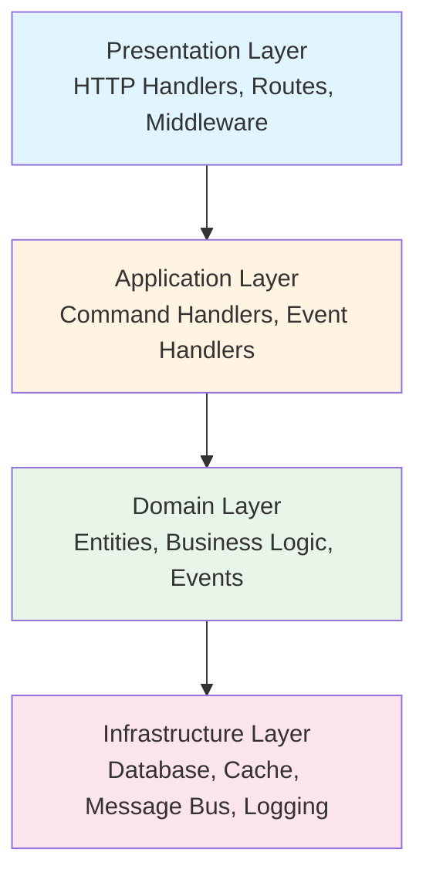

### الگوهای طراحی (Design Patterns)

#### 1. Domain-Driven Design (DDD)

**Domain-Driven Design** یک رویکرد طراحی نرم‌افزار است که تمرکز اصلی آن بر روی Domain Model و منطق کسب‌وکار است. در این پروژه، DDD به صورت کامل پیاده‌سازی شده است:

##### مفاهیم اصلی DDD در پروژه:

**Entities (موجودیت‌ها)**

- موجودیت‌های اصلی مانند `User`, `Product`, `Category` که دارای شناسه یکتا هستند
- هر Entity منطق کسب‌وکار خود را در بر می‌گیرد
- مثال: `User` Entity شامل منطق ثبت‌نام، احراز هویت و مدیریت پروفایل است

**Aggregates (تجمع‌ها)**

- `Product` به عنوان Aggregate Root عمل می‌کند
- شامل `ProductFeature`, `ProductDetail`, `ProductSpec` به عنوان Aggregate Entities
- تمام عملیات روی Aggregate Entities از طریق Aggregate Root انجام می‌شود

**Domain Events (رویدادهای دامنه)**

- رویدادهایی که در Domain رخ می‌دهند و منطق کسب‌وکار را نشان می‌دهند
- مثال: `RegisterUserEvent` - زمانی که کاربر جدید ثبت‌نام می‌کند
- این رویدادها برای decoupling و پردازش ناهمزمان استفاده می‌شوند

**Value Objects**

- اشیایی که بر اساس مقدارشان شناسایی می‌شوند نه شناسه
- مثال: آدرس، قیمت، رنگ محصول

**Repository Pattern**

- جداسازی منطق دسترسی به داده از Domain Logic
- Interface-based design برای قابلیت تست و انعطاف‌پذیری

##### مزایای DDD در این پروژه:

✅ **قابلیت نگهداری** - منطق کسب‌وکار در یک مکان متمرکز است  
✅ **قابلیت تست** - Domain Logic بدون وابستگی به Infrastructure قابل تست است  
✅ **قابلیت درک** - کد به زبان Domain Experts نزدیک است  
✅ **مقیاس‌پذیری** - ساختار ماژولار امکان افزودن Domain های جدید را فراهم می‌کند

---

#### 2. CQRS (Command Query Responsibility Segregation)

**CQRS** یک الگوی معماری است که عملیات خواندن (Read) و نوشتن (Write) را از هم جدا می‌کند. این الگو در این پروژه به صورت کامل پیاده‌سازی شده است:

##### تفکیک Command و Query:

**Commands (دستورات) - Write Operations**

- عملیاتی که state سیستم را تغییر می‌دهند
- مثال: `RegisterUser`, `CreateProduct`, `AddReview`
- هر Command یک Handler مخصوص دارد که منطق تغییر را اجرا می‌کند
- Commands از طریق Message Bus پردازش می‌شوند

**Queries (پرس‌وجوها) - Read Operations**

- عملیاتی که فقط داده را می‌خوانند و تغییری ایجاد نمی‌کنند
- مثال: `GetUser`, `ListProducts`, `GetProductDetails`
- Query Handlers مستقل از Command Handlers هستند
- می‌توانند از View Models یا DTO های بهینه شده استفاده کنند

##### ساختار CQRS در پروژه:

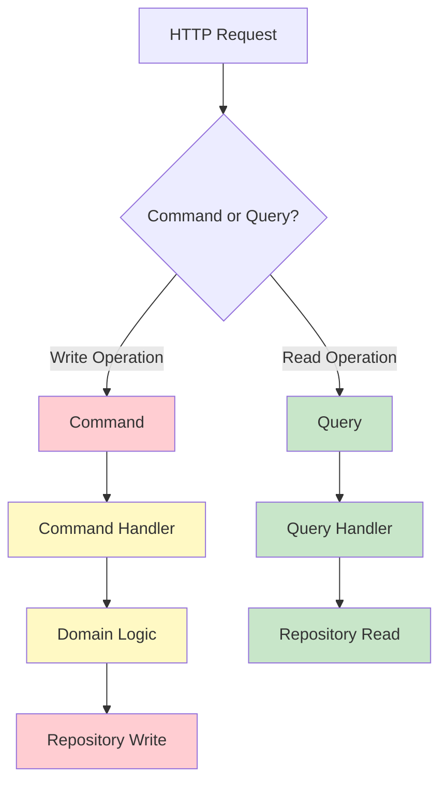

##### مزایای CQRS در این پروژه:

✅ **بهینه‌سازی عملکرد** - Query و Command می‌توانند به صورت مستقل بهینه شوند  
✅ **مقیاس‌پذیری** - می‌توان Read و Write را به صورت جداگانه scale کرد  
✅ **انعطاف‌پذیری** - می‌توان از دیتابیس‌های مختلف برای Read و Write استفاده کرد  
✅ **سادگی** - منطق Read و Write از هم جدا شده و ساده‌تر می‌شوند  
✅ **Caching** - Query ها می‌توانند به راحتی cache شوند بدون تأثیر بر Write operations

##### مثال عملی در پروژه:

**Command Example:**

```go
// Command Definition
type RegisterUser struct {
    UserName string
    Email    string
    Password string
}

// Command Handler
func (h *UserHandler) RegisterHandler(ctx context.Context, cmd *RegisterUser) {
    // Business Logic
    user := entity.NewUser(cmd.UserName, cmd.Email, cmd.Password)
    // Save through Repository
    h.uow.User(ctx).Save(ctx, user)
    // Events are automatically collected and published
}
```

**Query Example:**

```go
// Query Handler
func (h *UserQuery) GetUser(ctx context.Context, userID uint64) (*UserView, error) {
    // Optimized read operation
    // Can use different database, caching, etc.
    return h.userRepository.FindByID(ctx, userID)
}
```

#### 3. Event-Driven Architecture

**Event-Driven Architecture** یک الگوی معماری است که از Events برای ارتباط و هماهنگی بین کامپوننت‌های مختلف سیستم استفاده می‌کند:

##### Domain Events در پروژه:

**تعریف Domain Events**

- Events رویدادهایی هستند که در Domain رخ می‌دهند
- مثال: `RegisterUserEvent` - زمانی که کاربر جدید ثبت‌نام می‌کند
- Events به صورت immutable هستند و نشان‌دهنده چیزی هستند که اتفاق افتاده است

**Event Flow در پروژه:**

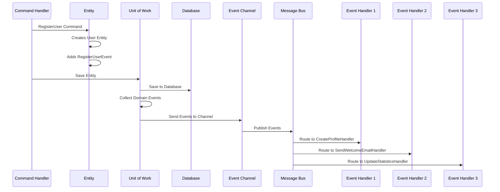

##### مزایای Event-Driven Architecture:

✅ **Decoupling** - کامپوننت‌ها از طریق Events ارتباط برقرار می‌کنند  
✅ **قابلیت توسعه** - افزودن Event Handler جدید بدون تغییر کد موجود  
✅ **پردازش ناهمزمان** - Events می‌توانند به صورت ناهمزمان پردازش شوند  
✅ **قابلیت بازیابی** - Events می‌توانند ذخیره و دوباره پردازش شوند  
✅ **Nested Events** - یک Event Handler می‌تواند Event جدید ایجاد کند

##### مثال عملی:

```go
// Domain Event
type RegisterUserEvent struct {
    UserID    uint64
    UserName  string
    Email     string
    Timestamp time.Time
}

// Event Handler
func (h *ProfileHandler) HandleRegisterEvent(ctx context.Context, event *RegisterUserEvent) error {
    // Automatically create profile when user registers
    profile := entity.NewProfile(event.UserID)
    return h.uow.Profile(ctx).Save(ctx, profile)
}
```

---

#### 4. Repository Pattern

**Repository Pattern** یک الگوی طراحی است که منطق دسترسی به داده را از Domain Logic جدا می‌کند:

##### ویژگی‌های Repository در پروژه:

- **Interface-based Design** - Repository ها به صورت Interface تعریف می‌شوند
- **Abstraction** - Domain Layer نیازی به دانستن جزئیات دیتابیس ندارد
- **Testability** - می‌توان Mock Repository برای تست استفاده کرد
- **Flexibility** - می‌توان Implementation را تغییر داد بدون تأثیر بر Domain

##### ساختار Repository:

```go
// Repository Interface
type UserRepository interface {
    Save(ctx context.Context, user *entity.User) error
    FindByID(ctx context.Context, id uint64) (*entity.User, error)
    FindByUserName(ctx context.Context, username string) (*entity.User, error)
}

// Implementation
type userRepository struct {
    db *gorm.DB
}

func (r *userRepository) Save(ctx context.Context, user *entity.User) error {
    return r.db.WithContext(ctx).Save(user).Error
}
```

---

#### 5. Unit of Work Pattern

**Unit of Work Pattern** یک الگوی طراحی است که Transaction ها و تغییرات را مدیریت می‌کند:

##### ویژگی‌های Unit of Work در پروژه:

**Transaction Management**

- تمام عملیات در یک Transaction انجام می‌شوند
- در صورت خطا، تمام تغییرات rollback می‌شوند
- Atomicity را تضمین می‌کند

**Event Collection**

- Domain Events را از Entities جمع‌آوری می‌کند
- Events را پس از commit موفق به Event Channel ارسال می‌کند
- از انتشار Events قبل از commit جلوگیری می‌کند

**Repository Caching**

- Repository های یک Transaction را cache می‌کند
- از ایجاد چندین instance جلوگیری می‌کند
- Performance را بهبود می‌بخشد

##### مثال استفاده:

```go
err := uow.Do(ctx, func(ctx context.Context) error {
    // All operations in single transaction
    user := uow.User(ctx).FindByID(ctx, userID)
    profile := uow.Profile(ctx).FindByUserID(ctx, userID)

    // If any operation fails, all changes are rolled back
    return nil
})

// Events are automatically collected and published after successful commit
```

---

#### 6. Message Bus Pattern

**Message Bus Pattern** یک الگوی معماری است که ارتباطات بین کامپوننت‌ها را مدیریت می‌کند:

##### ویژگی‌های Message Bus در پروژه:

**Centralized Command/Event Handling**

- تمام Commands و Events از طریق Message Bus پردازش می‌شوند
- Routing خودکار به Handler های مناسب
- Type-safe handling با استفاده از Generics

**Async Processing**

- Events می‌توانند به صورت ناهمزمان پردازش شوند
- از Event Channel برای ارتباط استفاده می‌کند
- Graceful Shutdown Support

**Handler Registration**

- Command و Event Handlers در زمان Bootstrap ثبت می‌شوند
- Dynamic routing بر اساس نوع Command/Event
- Logging و Error Handling یکپارچه

##### ساختار Message Bus:

```go
// Register Command Handler
bus.AddHandler(
    commandeventhandler.NewCommandHandlerWithResult(userHandler.RegisterHandler),
)

// Register Event Handler
bus.AddHandlerEvent(
    commandeventhandler.NewEventHandler(profileHandler.HandleRegisterEvent),
)

// Execute Command
result, err := bus.Handle(ctx, &commands.RegisterUser{...})

// Events are automatically published after successful command execution
```

---

### همکاری الگوهای طراحی

تمام الگوهای طراحی ذکر شده به صورت یکپارچه با هم کار می‌کنند تا یک معماری قوی و مقیاس‌پذیر ایجاد کنند:

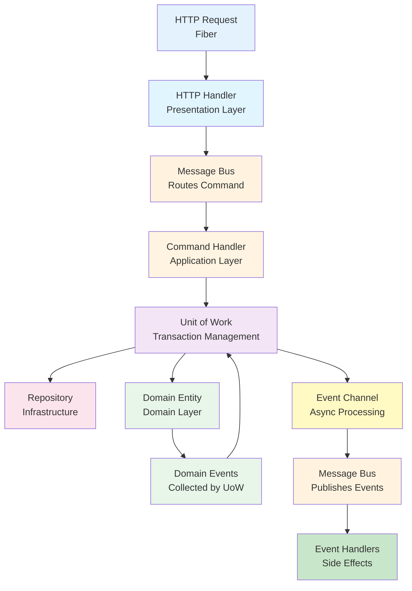

##### جریان کامل یک عملیات:

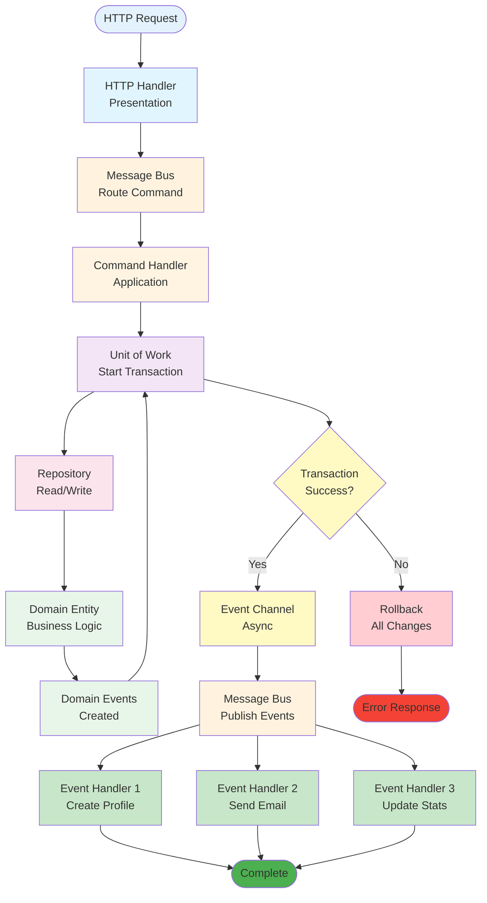

---

### ساختار ماژولار

پروژه به صورت **ماژولار** سازماندهی شده است که هر ماژول شامل:

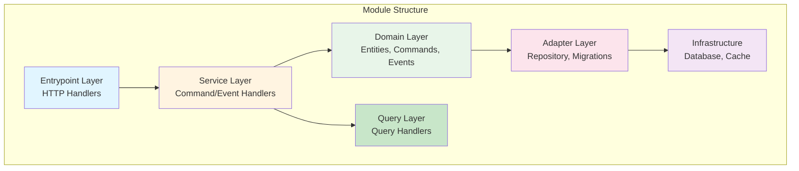

### ماژول‌های اصلی

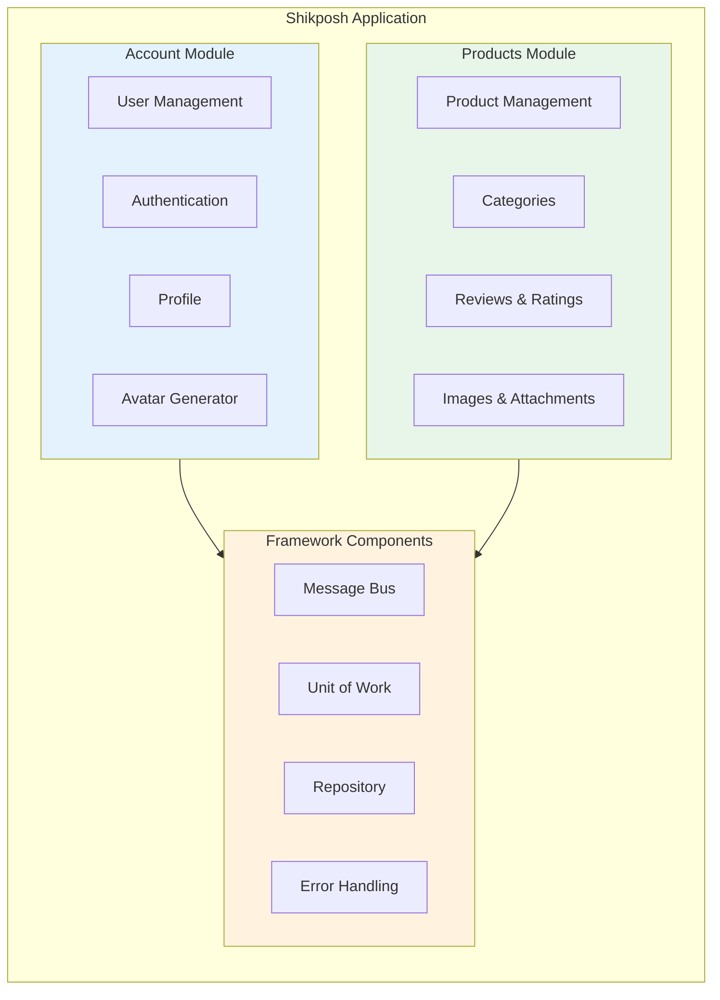

#### 1. Account Module

- مدیریت کاربران و احراز هویت
- پروفایل کاربری
- مدیریت نشست‌ها
- تولید آواتار خودکار

#### 2. Products Module

- مدیریت محصولات و دسته‌بندی‌ها
- سیستم نظرات و امتیازدهی
- مدیریت تصاویر و ضمیمه‌ها
- جزئیات محصول (رنگ، سایز، قیمت)

### Framework Components

پروژه شامل یک Framework داخلی است که کامپوننت‌های قابل استفاده مجدد را فراهم می‌کند:

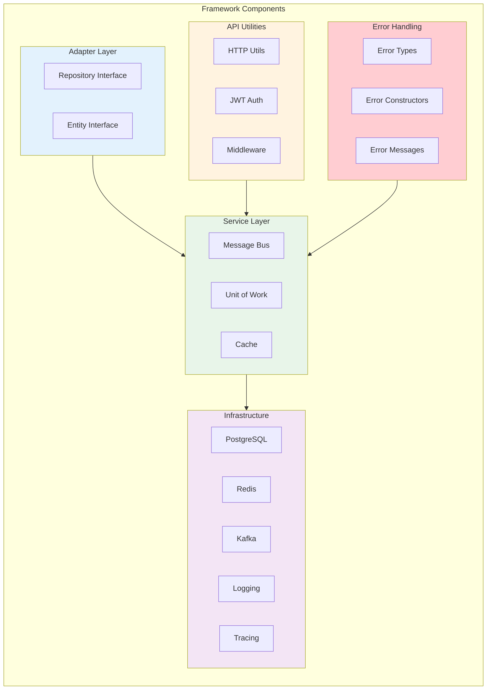

---

## 🚀 نصب و راه‌اندازی

### پیش‌نیازها

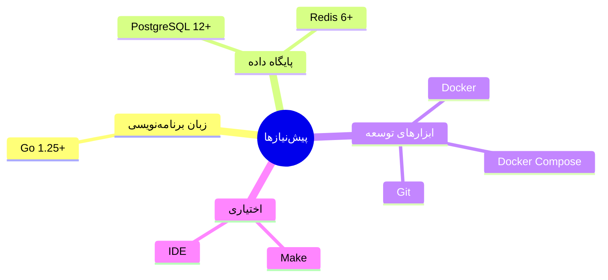

### مراحل نصب

1. **کلون کردن پروژه**

```bash
git clone git@github.com:ali-mahdavi-dev/shikposh-backend.git
cd shikposh-backend
```

2. **نصب وابستگی‌ها**

```bash
go mod download
```

3. **پیکربندی**

فایل تنظیمات را در پوشه `config/` ویرایش کنید.

4. **اجرای Migrations**

```bash
go run cmd/main.go migrate
```

5. **اجرای سرور**

```bash
go run cmd/main.go http
```

### استفاده از Docker

```bash
docker-compose up -d
```

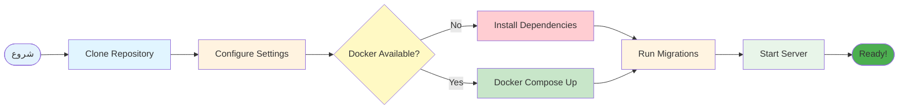

---

## 📚 مستندات API

مستندات کامل API با استفاده از Swagger در دسترس است:

- **Swagger UI**: `http://localhost:8000/swagger/index.html`
- **Swagger JSON**: `http://localhost:8000/swagger.json`

### Endpoints اصلی

#### احراز هویت

- `POST /api/v1/public/register` - ثبت‌نام کاربر
- `POST /api/v1/public/login` - ورود کاربر
- `POST /api/v1/public/logout` - خروج کاربر

#### محصولات

- `GET /api/v1/products` - لیست محصولات
- `GET /api/v1/products/{id}` - جزئیات محصول
- `POST /api/v1/products` - ایجاد محصول جدید (نیاز به احراز هویت)

#### دسته‌بندی‌ها

- `GET /api/v1/categories` - لیست دسته‌بندی‌ها

#### نظرات

- `GET /api/v1/products/{id}/reviews` - نظرات محصول
- `POST /api/v1/products/{id}/reviews` - ثبت نظر جدید

---

## 📊 مانیتورینگ

پروژه شامل سیستم‌های مانیتورینگ پیشرفته است:

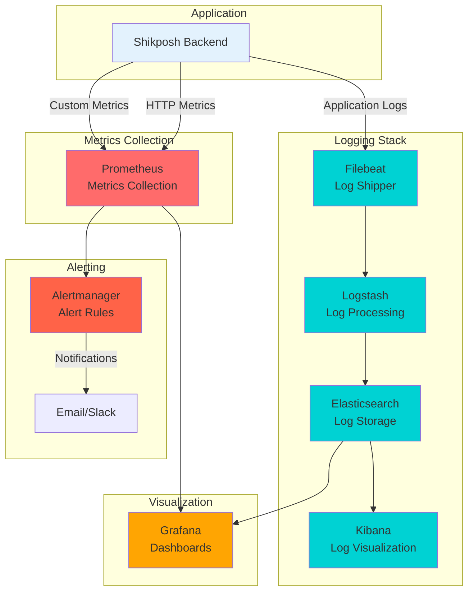

---

## 🔒 امنیت

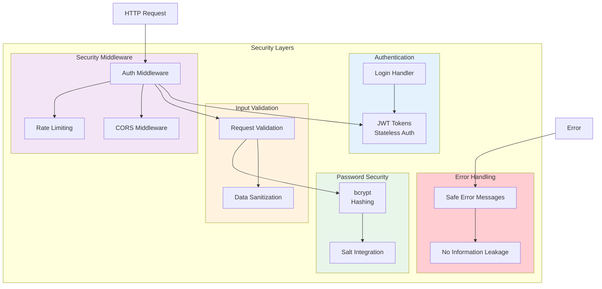

- احراز هویت مبتنی بر JWT
- رمزنگاری رمزهای عبور با bcrypt
- اعتبارسنجی ورودی‌ها
- مدیریت امن خطاها

---

## 📈 ویژگی‌های عملکردی

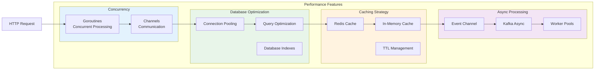

- پردازش همزمان درخواست‌ها
- مدیریت اتصالات دیتابیس
- استراتژی کش با Redis
- پردازش ناهمزمان رویدادها

---

## 🎨 ساختار پروژه

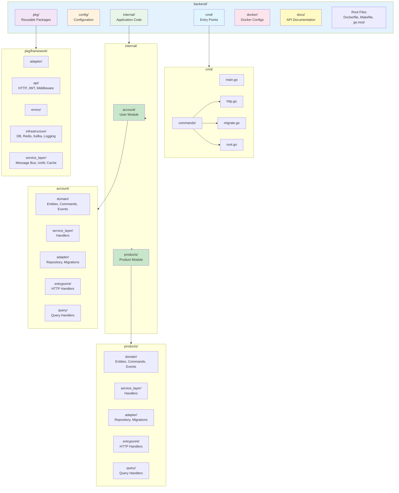

### توضیحات ساختار

#### 1. لایه Domain (دامنه)

- شامل Entities، Commands و Events
- منطق کسب‌وکار خالص بدون وابستگی به Infrastructure
- قابل تست و قابل استفاده مجدد

#### 2. لایه Application (کاربرد)

- Command Handlers و Event Handlers
- هماهنگی بین لایه‌ها
- Orchestration Logic

#### 3. لایه Infrastructure (زیرساخت)

- پیاده‌سازی Repository ها
- اتصالات دیتابیس، Redis، Kafka
- سیستم لاگینگ و Tracing

#### 4. لایه Presentation (ارائه)

- HTTP Handlers
- Routing و Middleware
- Request/Response Mapping

### مزایای این ساختار

✅ **قابلیت نگهداری** - کد تمیز و سازماندهی شده  
✅ **قابلیت تست** - جداسازی لایه‌ها امکان تست آسان را فراهم می‌کند  
✅ **مقیاس‌پذیری** - ساختار ماژولار امکان افزودن ویژگی‌های جدید را آسان می‌کند  
✅ **انعطاف‌پذیری** - امکان تغییر Implementation بدون تأثیر بر لایه‌های دیگر  
✅ **قابلیت استفاده مجدد** - کامپوننت‌های Framework در ماژول‌های مختلف قابل استفاده هستند

---

## 🤝 مشارکت

این پروژه به عنوان نمونه‌ای از مهارت‌های من در توسعه Backend با Go و معماری نرم‌افزار ساخته شده است.

---

## 📝 مجوز

این پروژه تحت مجوز MIT منتشر شده است.

---

## 👨‍💻 توسعه‌دهنده

**Ali Mahdavi**

- GitHub: [@ali-mahdavi-dev](https://github.com/ali-mahdavi-dev)

---

<div align="center">

**ساخته شده با ❤️ برای تجربه بهتر خرید و فروش آنلاین**

⭐ اگر این پروژه برای شما مفید بود، یک Star بدهید!

</div>
