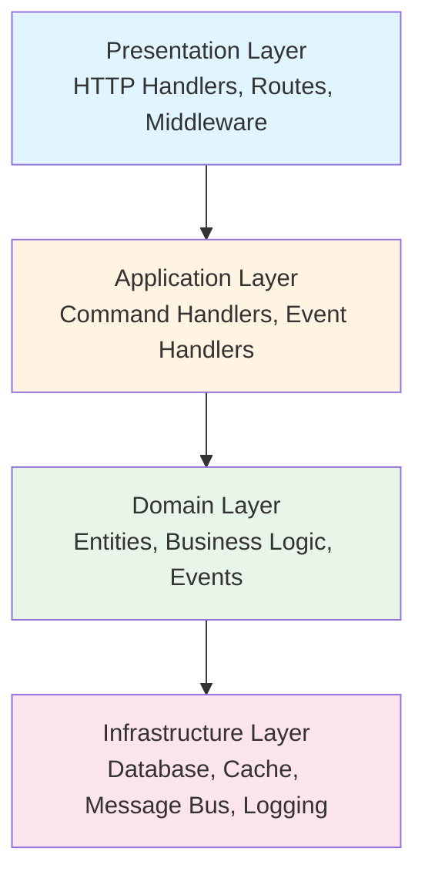
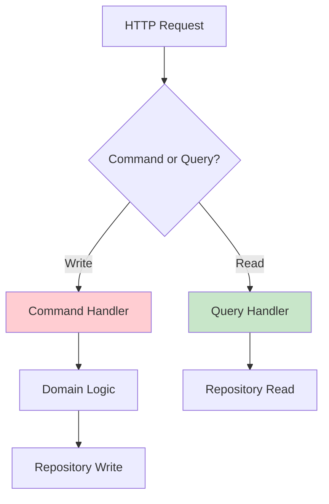
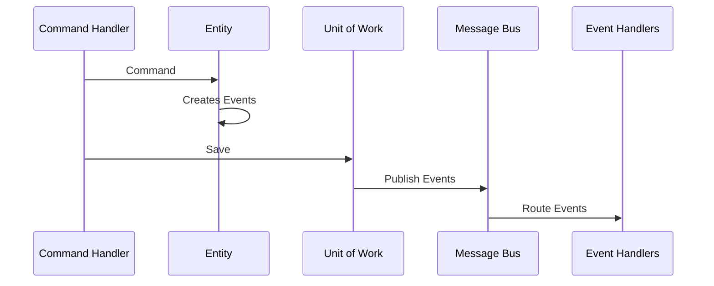
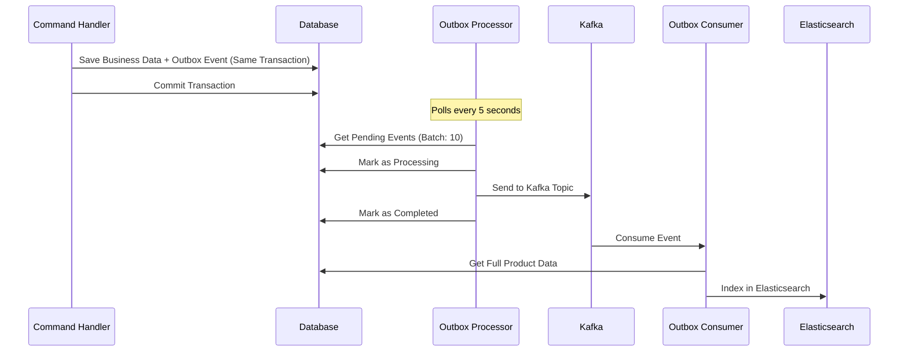
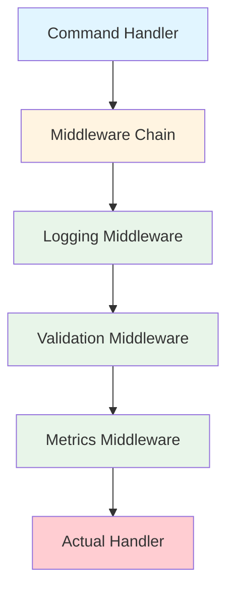
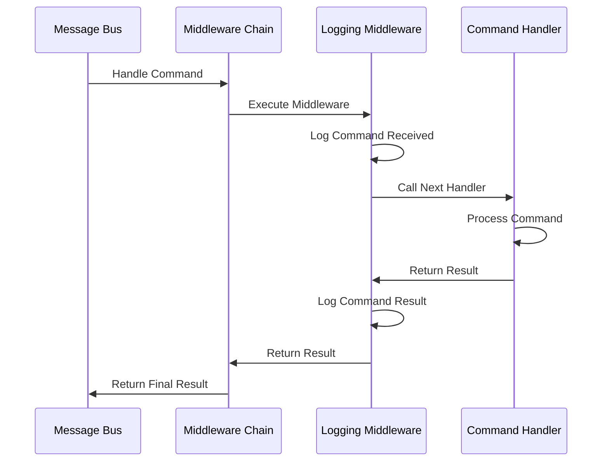

# 🛍️ Shikposh - Enterprise E-Commerce Backend

> A high-performance, scalable e-commerce backend built with Go, implementing Clean Architecture, DDD, CQRS, and Event-Driven patterns. Designed for production-ready applications with comprehensive monitoring and observability.

[](https://go.dev/)
[](https://gofiber.io/)
[](https://www.postgresql.org/)
[](https://redis.io/)
[](LICENSE)

### 🔗 Related Projects

- **Frontend Repository**: [shikposh](https://github.com/ali-mahdavi-dev/shikposh) - Modern e-commerce frontend built with Next.js 15, React 19, and TypeScript

---

## 📑 Table of Contents

- [✨ Features](#-features)
  - [🏗️ Architecture & Design Patterns](#️-architecture--design-patterns)
  - [🚀 Performance & Scalability](#-performance--scalability)
  - [🔐 Security & Authentication](#-security--authentication)
  - [📊 Monitoring & Observability](#-monitoring--observability)
  - [🛠️ Developer Experience](#️-developer-experience)
- [🛠️ Tech Stack](#️-tech-stack)
- [🏗️ Architecture](#️-architecture)
- [📁 Project Structure](#-project-structure)
- [🚀 Getting Started](#-getting-started)
- [📜 Available Commands](#-available-commands)
- [📚 API Documentation](#-api-documentation)
- [🔒 Security Features](#-security-features)
- [📊 Monitoring & Observability](#-monitoring--observability-1)
- [⚡ Performance Optimizations](#-performance-optimizations)
- [🧪 Testing](#-testing)
- [🚀 Deployment](#-deployment)
- [🤝 Contributing](#-contributing)
- [📄 License](#-license)
- [👨‍💻 Developer](#️-developer)

---

## ✨ Features

### 🏗️ Architecture & Design Patterns

- 🎯 **Clean Architecture** - Complete separation of concerns with layered architecture
- 🧩 **Domain-Driven Design (DDD)** - Rich domain models with business logic
- 📊 **CQRS** - Command Query Responsibility Segregation for optimized reads/writes
- 🎪 **Event-Driven Architecture** - Asynchronous event processing with message bus
- 🔄 **Repository Pattern** - Abstraction layer for data access
- 💼 **Unit of Work Pattern** - Transaction management and event collection
- 🚌 **Message Bus Pattern** - Centralized command/event routing
- 📦 **Outbox Pattern** - Reliable event publishing with transactional guarantees
- 🎨 **Decorator Pattern** - AOP-style middleware for cross-cutting concerns in command handlers

### 🚀 Performance & Scalability

- ⚡ **Fiber v3** - Ultra-fast HTTP framework based on FastHTTP
- 🔥 **Concurrent Processing** - Goroutine-based request handling
- 💾 **Connection Pooling** - Optimized database connections
- 🗄️ **Redis Caching** - High-performance caching strategy
- 📡 **Async Event Processing** - Non-blocking event handlers
- 🎯 **Optimized Queries** - Efficient database queries with GORM

### 🔐 Security & Authentication

- 🔑 **JWT Authentication** - Secure token-based authentication
- 🔒 **bcrypt Password Hashing** - Industry-standard password security
- ✅ **Input Validation** - Comprehensive request validation
- 🛡️ **Secure Error Handling** - No sensitive data leakage
- 🔐 **Session Management** - Redis-based session storage

### 📊 Monitoring & Observability

- 📈 **Prometheus** - Metrics collection and monitoring
- 📊 **Grafana** - Beautiful monitoring dashboards
- 📝 **ELK Stack** - Centralized logging (Elasticsearch, Filebeat, Kibana)
- 🔍 **Jaeger** - Distributed tracing with OpenTelemetry
- 📡 **Kafka** - Event streaming for microservices

### 🛠️ Developer Experience

- 📚 **Swagger/OpenAPI** - Interactive API documentation
- 🐳 **Docker & Docker Compose** - Easy development setup
- 🔄 **Database Migrations** - Version-controlled schema management
- 🧪 **Testing Support** - Unit and integration test infrastructure
- 📦 **Modular Design** - Easy to extend and maintain

---

## 🛠️ Tech Stack

<div align="center">


_System Architecture & Technology Stack_

</div>

### Core Framework

| Technology | Version     | Purpose                               |
| ---------- | ----------- | ------------------------------------- |
| **Go**     | 1.25        | High-performance programming language |
| **Fiber**  | v3.0.0-rc.2 | Fast HTTP web framework               |
| **GORM**   | 1.31.0      | Powerful ORM for database operations  |

### Database & Cache

| Technology     | Version | Purpose                        |
| -------------- | ------- | ------------------------------ |
| **PostgreSQL** | 12+     | Primary relational database    |
| **Redis**      | 6+      | Caching and session management |
| **SQLite**     | -       | Development/testing database   |

### Infrastructure & DevOps

| Technology         | Purpose                       |
| ------------------ | ----------------------------- |
| **Docker**         | Containerization              |
| **Docker Compose** | Multi-container orchestration |
| **Prometheus**     | Metrics collection            |
| **Grafana**        | Monitoring dashboards         |
| **ELK Stack**      | Log aggregation and analysis  |
| **Jaeger**         | Distributed tracing           |
| **Kafka**          | Event streaming platform      |

### Libraries & Tools

| Technology                   | Purpose                      |
| ---------------------------- | ---------------------------- |
| **JWT (golang-jwt)**         | Authentication tokens        |
| **Zerolog**                  | Structured logging           |
| **Viper**                    | Configuration management     |
| **Cobra**                    | CLI framework                |
| **Swagger**                  | API documentation            |
| **WebSocket (go-socket.io)** | Real-time communication      |
| **Sarama**                   | Kafka client                 |
| **OpenTelemetry**            | Observability framework      |
| **Jaeger Exporter**          | Distributed tracing exporter |

---

## 🏗️ Architecture

### Clean Architecture Layers

The project follows **Clean Architecture** principles with clear separation of concerns:



**🧩 Modular Architecture:**

The backend is built with a **highly modular architecture** that promotes separation of concerns, maintainability, and scalability. Each module is self-contained and follows a consistent structure:

**Module Structure:**

```
module/
├── entrypoint/          # HTTP handlers and routes
│   └── handler/         # Request handlers
├── service_layer/       # Application services
│   ├── command_handler/ # Write operations (CQRS)
│   └── event_handler/   # Event processing
├── domain/              # Business logic layer
│   ├── entity/          # Domain entities
│   ├── commands/        # Command DTOs
│   └── events/          # Domain events
├── query/               # Read operations (CQRS)
├── adapter/             # Infrastructure adapters
│   ├── repository/      # Data access layer
│   └── migrations/      # Database migrations
└── bootstrap.go         # Module initialization
```

**Key Benefits:**

- ✅ **Independent Modules** - Each module (Account, Products, etc.) operates independently
- ✅ **Isolated Dependencies** - Modules have their own dependencies and don't interfere with each other
- ✅ **Easy to Extend** - Add new modules without affecting existing ones
- ✅ **Testability** - Each module can be tested in isolation
- ✅ **Scalability** - Modules can be easily extracted into microservices
- ✅ **Consistent Structure** - All modules follow the same architectural pattern

**Current Modules:**

- 👤 **Account Module** - User management, authentication, profiles, and avatar generation
- 🛍️ **Products Module** - Product management, categories, reviews, and product aggregates

**Module Initialization:**
Each module has a `Bootstrap()` function that:

- Initializes its own Unit of Work and Message Bus
- Registers command and event handlers
- Sets up HTTP routes
- Configures module-specific dependencies

This modular approach makes the codebase highly maintainable and ready for microservices migration when needed.

### Design Patterns

#### 1. Domain-Driven Design (DDD)

- **Rich Domain Models** - Entities with business logic
- **Aggregates** - Product as Aggregate Root
- **Domain Events** - Decoupled event-driven communication
- **Repository Pattern** - Abstracted data access

#### 2. CQRS (Command Query Responsibility Segregation)

Separate read and write operations for optimal performance:



#### 3. Event-Driven Architecture

Asynchronous event processing for scalability:



#### 4. Repository Pattern

- Interface-based design for testability
- Database abstraction
- Easy to mock for testing

#### 5. Unit of Work Pattern

- Transaction management
- Event collection and publishing
- Repository caching

#### 6. Message Bus Pattern

- Centralized command/event handling
- Type-safe routing
- Async processing

#### 7. Outbox Pattern

The **Outbox Pattern** ensures reliable event publishing by storing events in a database table within the same transaction as the business data. This guarantees **exactly-once delivery** and prevents event loss even if the message broker is temporarily unavailable.

**How it works:**



**Key Components:**

1. **Outbox Table** - Stores events with status tracking:

   - `status`: pending, processing, completed, failed
   - `retry_count`: Automatic retry mechanism
   - `max_retries`: Configurable retry limit (default: 5)
   - `error_message`: Error tracking for failed events

2. **Outbox Processor** - Background service that:

   - Polls the database every 5 seconds for pending events
   - Processes events in batches (default: 10 events)
   - Sends events to Kafka topic (`product.events`)
   - Handles retries automatically
   - Marks events as completed or failed

3. **Outbox Consumer** - Kafka consumer that:
   - Consumes events from Kafka
   - Retrieves full aggregate data from database
   - Indexes data in Elasticsearch for search
   - Handles different event types (ProductCreatedEvent, etc.)

**Benefits:**

- ✅ **Transactional Guarantees** - Events saved in same transaction as business data
- ✅ **Reliability** - No event loss even if Kafka is down
- ✅ **Exactly-Once Delivery** - Prevents duplicate events
- ✅ **Automatic Retries** - Built-in retry mechanism with configurable limits
- ✅ **Error Handling** - Failed events tracked with error messages
- ✅ **Scalability** - Can process events asynchronously without blocking business logic

**Implementation Details:**

- **Event Creation**: Events are saved to `outbox_events` table within the same transaction
- **Processing**: Background processor polls and processes events every 5 seconds
- **Kafka Integration**: Events are published to `product.events` topic
- **Elasticsearch Indexing**: Consumer indexes products in Elasticsearch for search functionality
- **Status Tracking**: Events go through states: `pending` → `processing` → `completed`/`failed`

**Configuration:**

```go
const (
    KafkaTopicProductEvents = "product.events"
    BatchSize               = 10        // Events per batch
    PollInterval            = 5 seconds // Polling frequency
)
```

**Database Schema:**

```sql
CREATE TABLE outbox_events (
    id BIGINT PRIMARY KEY,
    event_type VARCHAR(255) NOT NULL,
    aggregate_type VARCHAR(255) NOT NULL,
    aggregate_id VARCHAR(255) NOT NULL,
    payload JSONB NOT NULL,
    status VARCHAR(50) DEFAULT 'pending',
    retry_count INTEGER DEFAULT 0,
    max_retries INTEGER DEFAULT 5,
    error_message TEXT,
    processed_at TIMESTAMP,
    created_at TIMESTAMP DEFAULT CURRENT_TIMESTAMP,
    updated_at TIMESTAMP DEFAULT CURRENT_TIMESTAMP
);
```

#### 8. Decorator Pattern (AOP for Command Handlers)

The **Decorator Pattern** is used to add cross-cutting concerns to command handlers in an **Aspect-Oriented Programming (AOP)** style. This allows us to wrap command handlers with additional functionality like logging, validation, metrics, retry logic, and more without modifying the core handler logic.

**How it works:**



**Architecture:**



**Key Components:**

1. **CommandHandlerFunc** - Base function type for command handlers:

   ```go
   type CommandHandlerFunc func(ctx context.Context, cmd any) error
   ```

2. **Middleware** - Function that wraps a handler with additional behavior:

   ```go
   type Middleware func(next CommandHandlerFunc) CommandHandlerFunc
   ```

3. **Middleware Chain** - Chains multiple middlewares together:
   ```go
   func Chain(middlewares ...Middleware) Middleware
   ```

**Example Implementation:**

**Creating a Middleware:**

```go
// Logging middleware example
func Logging() Middleware {
    return func(next CommandHandlerFunc) CommandHandlerFunc {
        return func(ctx context.Context, cmd any) error {
            cmdName := reflect.TypeOf(cmd).String()

            // Before handler execution
            logging.Info("Command received").
                WithAny("command_name", cmdName).
                WithAny("command", cmd).
                Log()

            // Execute the actual handler
            err := next(ctx, cmd)

            // After handler execution
            if err != nil {
                logging.Error("Command failed").
                    WithAny("command_name", cmdName).
                    WithError(err).
                    Log()
                return err
            }

            logging.Info("Command handled successfully").
                WithAny("command_name", cmdName).
                Log()

            return nil
        }
    }
}
```

**Registering Middlewares:**

```go
// In bootstrap.go
bus.AddCommandMiddleware(
    commandmiddleware.Logging(),
    // Add more middlewares here:
    // commandmiddleware.Validation(),
    // commandmiddleware.Metrics(),
    // commandmiddleware.Retry(),
)
```

**How Middlewares are Applied:**

```go
// In MessageBus.Handle()
baseHandler := func(ctx context.Context, cmd any) error {
    return handler.Handle(ctx, cmd)
}

// Apply middlewares using decorator pattern
finalHandler := commandmiddleware.ApplyChain(baseHandler, m.commandMiddlewares...)

// Execute the handler with middlewares applied
return finalHandler(ctx, cmd)
```

**Use Cases:**

- ✅ **Logging** - Log all command executions, successes, and failures
- ✅ **Metrics** - Track command execution times, success rates, and error counts
- ✅ **Validation** - Validate commands before handler execution
- ✅ **Retry Logic** - Automatically retry failed commands with exponential backoff
- ✅ **Authorization** - Check permissions before executing commands
- ✅ **Rate Limiting** - Limit command execution rate per user/service
- ✅ **Circuit Breaker** - Prevent cascading failures
- ✅ **Tracing** - Add distributed tracing spans for commands
- ✅ **Caching** - Cache command results when appropriate
- ✅ **Transaction Management** - Wrap commands in transactions

**Benefits:**

- ✅ **Separation of Concerns** - Cross-cutting concerns separated from business logic
- ✅ **Reusability** - Middlewares can be reused across multiple handlers
- ✅ **Composability** - Multiple middlewares can be chained together
- ✅ **Testability** - Handlers can be tested without middleware concerns
- ✅ **Flexibility** - Easy to add/remove cross-cutting concerns
- ✅ **AOP Style** - Aspect-Oriented Programming for clean code
- ✅ **Non-Invasive** - No need to modify existing handler code

**Current Middlewares:**

- **Logging Middleware** - Logs command execution lifecycle (received, success, failure)

**Future Middleware Examples:**

```go
// Validation Middleware
func Validation() Middleware {
    return func(next CommandHandlerFunc) CommandHandlerFunc {
        return func(ctx context.Context, cmd any) error {
            // Validate command before execution
            if err := validateCommand(cmd); err != nil {
                return err
            }
            return next(ctx, cmd)
        }
    }
}

// Metrics Middleware
func Metrics() Middleware {
    return func(next CommandHandlerFunc) CommandHandlerFunc {
        return func(ctx context.Context, cmd any) error {
            start := time.Now()
            err := next(ctx, cmd)
            duration := time.Since(start)

            // Record metrics
            recordCommandMetrics(cmd, duration, err)
            return err
        }
    }
}

// Retry Middleware
func Retry(maxRetries int) Middleware {
    return func(next CommandHandlerFunc) CommandHandlerFunc {
        return func(ctx context.Context, cmd any) error {
            var err error
            for i := 0; i < maxRetries; i++ {
                err = next(ctx, cmd)
                if err == nil {
                    return nil
                }
                time.Sleep(time.Duration(i+1) * time.Second)
            }
            return err
        }
    }
}
```

### Module Structure

Each module follows a consistent structure:

```
module/
├── entrypoint/          # HTTP handlers and routes
│   └── handler/         # Request handlers
├── service_layer/       # Application services
│   ├── command_handler/ # Write operations
│   └── event_handler/   # Event processing
├── domain/              # Business logic
│   ├── entity/         # Domain entities
│   ├── commands/        # Command DTOs
│   └── events/          # Domain events
├── query/               # Read operations (CQRS)
├── adapter/             # Infrastructure adapters
│   ├── repository/      # Data access
│   └── migrations/      # Database migrations
└── bootstrap.go         # Module initialization
```

### Main Modules

#### 👤 Account Module

- User registration and authentication
- JWT token management
- User profiles with avatar generation
- Session management

#### 🛍️ Products Module

- Product management (CRUD)
- Category management
- Product reviews and ratings
- Product aggregates (features, details, specs)
- Image attachments
- **Outbox Pattern** - Reliable event publishing to Kafka
- **Elasticsearch Integration** - Automatic product indexing via Kafka consumer

---

## 📁 Project Structure

```
backend/
├── 📂 cmd/                    # Application entry points
│   ├── commands/              # CLI commands
│   │   ├── http.go           # HTTP server command
│   │   ├── migrate.go        # Migration commands
│   │   └── root.go           # Root command
│   └── main.go               # Main entry point
│
├── 📂 config/                 # Configuration files
│   ├── config-development.yml # Development config
│   ├── config-docker.yml     # Docker config
│   ├── config-production.yml  # Production config
│   └── config.go             # Config loader
│
├── 📂 internal/               # Application code
│   ├── account/              # User management module
│   │   ├── adapter/          # Infrastructure adapters
│   │   ├── domain/           # Domain layer
│   │   ├── entrypoint/       # HTTP handlers
│   │   ├── query/            # Read operations
│   │   └── service_layer/    # Application services
│   └── products/             # Product management module
│       ├── adapter/          # Infrastructure adapters
│       ├── domain/           # Domain layer
│       ├── entrypoint/       # HTTP handlers
│       ├── query/            # Read operations
│       └── service_layer/   # Application services
│
├── 📂 pkg/                    # Reusable packages
│   └── framework/            # Framework components
│       ├── adapter/          # Base adapters
│       ├── api/              # API utilities
│       ├── errors/           # Error handling
│       ├── helpers/          # Helper functions
│       ├── infrastructure/   # Infrastructure services
│       └── service_layer/    # Service layer utilities
│
├── 📂 docker/                 # Docker configurations
│   ├── docker-compose.yml    # Multi-container setup
│   ├── prometheus/           # Prometheus config
│   ├── grafana/             # Grafana config
│   ├── elk/                 # ELK stack config
│   └── redis/               # Redis config
│
├── 📂 docs/                   # API documentation
│   ├── swagger.json          # Swagger JSON
│   ├── swagger.yaml          # Swagger YAML
│   └── apwp_aa01.png         # Architecture diagram
│
├── go.mod                     # Go module definition
├── go.sum                     # Dependency checksums
├── Makefile                   # Build automation
└── Dockerfile                # Container definition
```

---

## 🚀 Getting Started

### Prerequisites

Before you begin, ensure you have the following installed:

- **Go** 1.25 or higher
- **PostgreSQL** 12 or higher
- **Redis** 6 or higher
- **Docker & Docker Compose** (optional, for full stack)

### Installation

#### 1️⃣ Clone the Repository

```bash
git clone <repository-url>
cd shikposh/backend
```

#### 2️⃣ Install Dependencies

```bash
go mod download
```

#### 3️⃣ Configure the Application

Edit configuration files in the `config/` directory:

```yaml
# config/config-development.yml
database:
  host: localhost
  port: 5432
  user: postgres
  password: password
  dbname: shikposh

redis:
  host: localhost
  port: 6379
```

#### 4️⃣ Run Database Migrations

```bash
# Using Make
make migrate-up

# Or directly
go run cmd/main.go migrate up
```

#### 5️⃣ Start the Server

```bash
# Using Make
make run

# Or directly
go run cmd/main.go http
```

The server will start on `http://localhost:8000` (default port).

### 🐳 Docker Setup

For a complete development environment with all services:

```bash
cd docker
docker-compose up -d
```

This starts:

- PostgreSQL database
- Redis cache
- Prometheus metrics
- Grafana dashboards
- ELK stack for logging
- **Jaeger** for distributed tracing
- Kafka for event streaming

---

## 📜 Available Commands

### Development

```bash
# Run the HTTP server
make run
go run cmd/main.go http

# Run with custom config
go run cmd/main.go http --config config/config-development.yml
```

### Database Migrations

```bash
# Run migrations
make migrate-up
go run cmd/main.go migrate up

# Rollback migrations
make migrate-down
go run cmd/main.go migrate down
```

### Testing

```bash
# Run all tests
make test
go test ./tests/... -v

# Run integration tests
make test-integration
TEST_TYPE=integration go test ./tests/integration/... -v
```

### API Documentation

```bash
# Generate Swagger documentation
make swagger
swag fmt && swag init -g ./cmd/main.go -o ./docs
```

---

## 📚 API Documentation

### Swagger UI

Interactive API documentation is available at:

- **Swagger UI**: `http://localhost:8000/swagger/index.html`
- **Swagger JSON**: `http://localhost:8000/swagger.json`
- **Swagger YAML**: `http://localhost:8000/swagger.yaml`

### Main API Endpoints

#### 🔐 Authentication

| Method | Endpoint                  | Description       |
| ------ | ------------------------- | ----------------- |
| `POST` | `/api/v1/public/register` | User registration |
| `POST` | `/api/v1/public/login`    | User login        |
| `POST` | `/api/v1/public/logout`   | User logout       |

#### 🛍️ Products

| Method | Endpoint                                     | Description                      |
| ------ | -------------------------------------------- | -------------------------------- |
| `GET`  | `/api/v1/public/products`                    | List all products (with filters) |
| `GET`  | `/api/v1/public/products/:slug`              | Get product by slug              |
| `GET`  | `/api/v1/public/products/featured`           | Get featured products            |
| `GET`  | `/api/v1/public/products/category/:category` | Get products by category         |

**Query Parameters:**

- `q` - Search query
- `category` - Category slug
- `min` - Minimum price
- `max` - Maximum price
- `rating` - Minimum rating
- `featured` - Featured products only
- `tags` - Comma-separated tags
- `sort` - Sort order (price_asc, price_desc, rating, newest)

#### 📂 Categories

| Method | Endpoint                    | Description         |
| ------ | --------------------------- | ------------------- |
| `GET`  | `/api/v1/public/categories` | List all categories |

#### ⭐ Reviews

| Method  | Endpoint                              | Description                 |
| ------- | ------------------------------------- | --------------------------- |
| `GET`   | `/api/v1/public/products/:id/reviews` | Get product reviews         |
| `POST`  | `/api/v1/public/reviews`              | Create a review             |
| `PATCH` | `/api/v1/public/reviews/:id`          | Update review helpful count |

#### 👤 User Profile

| Method | Endpoint                          | Description      |
| ------ | --------------------------------- | ---------------- |
| `GET`  | `/api/v1/public/users/:id`        | Get user profile |
| `GET`  | `/api/v1/public/users/:id/avatar` | Get user avatar  |

---

## 🔒 Security Features

### Authentication & Authorization

- **JWT Tokens** - Secure token-based authentication
- **bcrypt Hashing** - Industry-standard password hashing (cost: 10)
- **Token Expiration** - Configurable token expiration
- **Session Management** - Redis-based session storage

### Input Validation

- Request validation using Fiber validators
- SQL injection prevention via GORM
- XSS protection in error messages
- Secure error handling (no sensitive data leakage)

### Best Practices

- Environment-based configuration
- Secure default settings
- HTTPS support in production
- CORS configuration
- Rate limiting (configurable)

---

## 📊 Monitoring & Observability

### Metrics (Prometheus)

The application exposes metrics at `/metrics`:

- HTTP request duration
- Request count by endpoint
- Error rates
- Database query performance
- Cache hit/miss rates

### Logging (ELK Stack)

Structured logging with Zerolog:

- **Elasticsearch** - Log storage and indexing
- **Filebeat** - Log collection agent
- **Kibana** - Log visualization and analysis

### Dashboards (Grafana)

Pre-configured dashboards for:

- Application performance
- Database metrics
- Cache performance
- Error tracking
- Request patterns

### Distributed Tracing (Jaeger)

**Jaeger** integration via OpenTelemetry for:

- **Request Tracing** - End-to-end request tracing across services
- **Performance Analysis** - Identify bottlenecks and slow operations
- **Service Dependencies** - Visualize service interactions
- **Span Analysis** - Detailed span timing and metadata
- **Trace Search** - Search and filter traces by tags and attributes

**Access Jaeger UI:**

- **Jaeger UI**: `http://localhost:16686`
- **OTLP HTTP Endpoint**: `http://localhost:4318`
- **OTLP gRPC Endpoint**: `http://localhost:4317`

**Features:**

- OpenTelemetry (OTLP) protocol support
- Configurable sampling rates
- Service and environment tagging
- Trace context propagation

---

## ⚡ Performance Optimizations

### Database

- **Connection Pooling** - Optimized connection management
- **Query Optimization** - Efficient GORM queries
- **Indexes** - Strategic database indexes
- **Prepared Statements** - SQL injection prevention + performance

### Caching

- **Redis Caching** - Frequently accessed data
- **Cache Invalidation** - Smart cache invalidation strategies
- **TTL Management** - Configurable cache expiration

### Concurrency

- **Goroutines** - Concurrent request processing
- **Channel-based Communication** - Efficient event handling
- **Async Event Processing** - Non-blocking operations

### Code Optimizations

- **Zero-copy** where possible
- **Efficient serialization** (JSON)
- **Minimal allocations** in hot paths
- **Connection reuse** for external services

---

## 🧪 Testing

### Running Tests

```bash
# Run all unit tests
make test

# Run integration tests
make test-integration

# Run with coverage
go test ./... -cover
```

### Test Structure

```
tests/
├── unit/              # Unit tests
└── integration/       # Integration tests
```

### Testing Best Practices

- Unit tests for business logic
- Integration tests for API endpoints
- Mock repositories for isolation
- Test fixtures for consistent data

---

## 🚀 Deployment

### Production Build

```bash
# Build binary
go build -o bin/shikposh cmd/main.go

# Run production server
./bin/shikposh http --config config/config-production.yml
```

### Docker Deployment

```bash
# Build Docker image
docker build -t shikposh-backend .

# Run container
docker run -p 8000:8000 \
  -e DATABASE_URL=postgres://... \
  -e REDIS_URL=redis://... \
  shikposh-backend
```

### Environment Variables

```env
# Database
DATABASE_HOST=localhost
DATABASE_PORT=5432
DATABASE_USER=postgres
DATABASE_PASSWORD=password
DATABASE_NAME=shikposh

# Redis
REDIS_HOST=localhost
REDIS_PORT=6379

# Server
SERVER_PORT=8000
SERVER_HOST=0.0.0.0

# JWT
JWT_SECRET=your-secret-key
JWT_EXPIRATION=24h

# Jaeger Tracing
JAEGER_ENABLED=true
JAEGER_SERVICE_NAME=shikposh-backend
JAEGER_ENVIRONMENT=development
JAEGER_OTLP_ENDPOINT=http://localhost:4318
JAEGER_SAMPLING_RATE=1.0
```

---

## 🤝 Contributing

We welcome contributions! Please follow these steps:

1. 🍴 Fork the repository
2. 🌿 Create a feature branch (`git checkout -b feature/amazing-feature`)
3. 💾 Commit your changes (`git commit -m 'Add amazing feature'`)
4. 📤 Push to the branch (`git push origin feature/amazing-feature`)
5. 🔀 Open a Pull Request

### Code Style

- Follow Go conventions and best practices
- Use `gofmt` for code formatting
- Write comprehensive tests
- Update documentation

---

## 📄 License

This project is licensed under the MIT License - see the LICENSE file for details.

---

## 👨‍💻 Developer

**Ali Mahdavi**

- GitHub: [@ali-mahdavi-dev](https://github.com/ali-mahdavi-dev)

---

<div align="center">

**Built with ❤️ to showcase enterprise backend development skills**

[](https://go.dev/)
[](https://gofiber.io/)
[](https://www.postgresql.org/)

⭐ If you find this project interesting, give it a Star!

</div>
